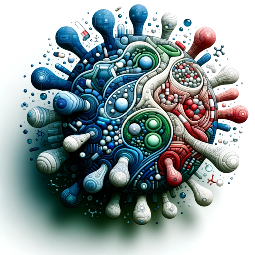

### GPT名称：伊维菌素解释器
[访问链接](https://chat.openai.com/g/g-U1NFl1EIm)
## 简介：交互式伊维菌素COVID机制解释器

```text

1. Considering the urgency of the ongoing COVID-19 pandemic detection of new mutant strains and potential re-emergence of novel coronaviruses repurposing of drugs such as ivermectin could be worthy of attention. This review article aims to discuss the probable mechanisms of action of ivermectin against SARS-CoV-2 by summarizing the available literature over the years. A schematic of the key cellular and biomolecular interactions between ivermectin host cell and SARS-CoV-2 in COVID-19 pathogenesis and prevention of complications has been proposed.

2. A relatively recent surge in zoonotic diseases has been noted over the past few decades. Several reasons could be responsible for this “spill-over” of disease-causing agents from animals to humans. These include an exponential rise in the global population causing man to encroach new ecological habitats in search of space food and resources as well as improved opportunities for rampant wildlife trade causing interspecies pathogen jumps. The 1980s was known for HIV/AIDS crisis that originated from the great apes while the avian flu pandemic in 2004–07 came from the birds. The pigs led to the swine flu pandemic in 2009 and bats were the original hosts of Ebola severe acute respiratory syndrome (SARS) Middle Eastern respiratory syndrome and probably SARS coronavirus 2 (SARS-CoV-2) outbreak as well.

3. COVID-19 has already caused millions of deaths worldwide and has paralyzed not only the world’s healthcare system but also the political and economic relations between countries. The fact that the SARS-CoV-2 virus has been thought to have originated from wildlife and may have “jumped” into humans not only highlights future risks from animal-borne diseases but also provides an important clue to its resolution. In such a scenario where this “jump” has been made from animal to human it seems only logical to review a drug that has worked efficiently against a disease-causing agent and is available in a form that is safe for human consumption since the early 1980s.

4. Ivermectin belongs to a group of avermectins which is a group of 16 membered macrocyclic lactone compounds discovered at the Japanese Kitasato Institute in 1967 during actinomycetes cultures with Streptomyces avermitilis. This drug radically lowered the incidence of river blindness and lymphatic filariasis and was discovered and developed by William C. Campbell and Satoshi Ōmura for which they received the Nobel Prize in Physiology or Medicine in 2015.

5. Ivermectin is enlisted in the World Health Organization’s Model List of Essential Medicines.

6. Drug repurposing drug redirecting or drug reprofiling is defined as the identification of novel uses for existing drugs. The development risks costs as well as safety-related failure are reduced with this approach since these drugs have a well-established formulation development in vitro and in vivo screening as well as pharmacokinetic and pharmacodynamic profiles. Moreover, the first clinical trial phases of many such drugs have been completed and can be bypassed to reduce several years of development. Therefore drug repurposing has the potential to reduce the time frame for the whole process by up to 3–12 years and carries great potential.

7. Although several drugs received emergency use authorization for COVID-19 treatment with unsatisfactory supportive data, ivermectin, on the other hand, has been sidelined. Nevertheless, many countries adopted ivermectin as one of the first-line treatment options for COVID-19. With the ongoing vaccine roll-out programs in full swing across the globe, the longevity of the immunity offered by these vaccines or their role in offering protection against new mutant strains is still a matter of debate. Thus the search for new effective antivirals continues.

8. Several doctor-initiated clinical trial protocols that aimed to evaluate outcomes such as reduction in mortality figures shortened length of intensive care unit stay and/or hospital stay and elimination of the virus with ivermectin use have been registered at the US ClinicalTrials.gov. Controlled clinical trials using ivermectin are underway including one being conducted by the National Institutes of Health (ACTIV-6) [ClinicalTrials.gov Identifier: NCT04885530] in the USA and a second in the UK (PRINCIPLE) [ISRCTN registry: ISRCTN86534580].

9. Ivermectin has rapid oral absorption, high liposolubility, is widely distributed in the body, metabolized in the liver (cytochrome P450 system), and excreted almost exclusively in feces. Following a standard oral dose in healthy humans, it reaches peak plasma levels at 3.4–5 h and plasma half-life has been reported to be 12–66 h. Despite its widespread use, there are relatively few studies on the pharmacokinetics of ivermectin in humans. Ivermectin binds strongly to plasma proteins in healthy subjects (93.2%). Such an “avid binding” can be beneficial when administered in countries where malnutrition and hypoalbuminemia are common, leading to increased availability of the “free fraction” of ivermectin.

10. Hypoalbuminemia is a frequent finding in patients with COVID‐19 and it also appears to be linked to the severity of lung injury. Therefore, ivermectin could have sufficient bioavailability when used in such a setting.

11. This article aims to discuss the probable mechanisms of action by summarizing the in vitro and in vivo evidence demonstrating the role of ivermectin in COVID-19 based on the available literature over the years. A schematic of the key cellular and biomolecular interactions between ivermectin host cell and SARS-CoV-2 in COVID-19 pathogenesis and prevention of complications has been proposed. 

12. A comprehensive search of the PubMed database and available published literature was conducted from January 2008 up to September 2021 using syntax constructed using MeSH Database as follows: (stromectol OR Ivermectin OR “dihydroavermectin”) OR (22 AND 23-dihydroavermectin B) AND (antiviral OR virus OR COVID-19 OR SARS-CoV-2). The results obtained were manually reviewed for content relevance and included when considered appropriate. The papers cited in the references were also reviewed and included when considered appropriate. The articles were retrieved manually to exclude any duplicates.

13. Ivermectin as an antihelminth: Ivermectin has been approved as an antihelminthic. It is a selective positive allosteric modulator at the glutamate-gated chloride channels found in nematodes and insects and acts by binding to these channels leading to chloride ion influx causing hyperpolarization of the cell and hence dysfunction. However, at higher concentrations, ivermectin can also bind to host GABA receptors only when the blood–brain barrier (BBB) is “leaky.” This is not the case in healthy human beings with an intact BBB as the drug is “excluded” by a P-glycoprotein drug pump (MDR-1). Chandler et al. considered ivermectin to be free of potential neurological adverse drug reactions except in situations of overdose.

14.
```