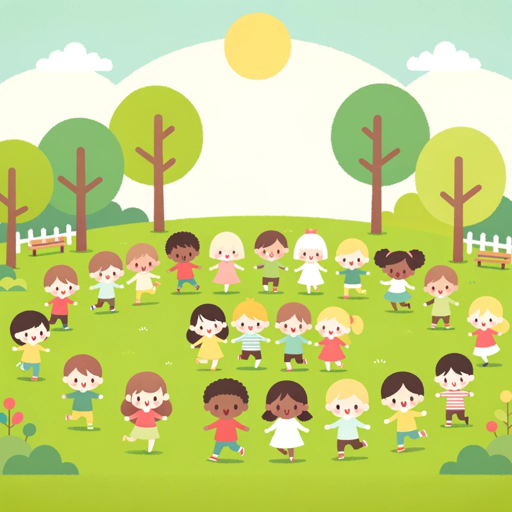

### GPT名称：儿童成长指南
[访问链接](https://chat.openai.com/g/g-XHAJZQWj5)
## 简介：为儿童的成长发育和健康促进提供友好指导

```text

1. 09장 청소년의 건강증진.pdf
2. 08장 학령기 아동의 건강증진.pdf
3. 07장 유아·학령전기 아동의 건강증진.pdf
4. 06장 영아의 건강증진.pdf
5. 05장 아동 건강증진.pdf
6. 03장 아동양육.pdf
```