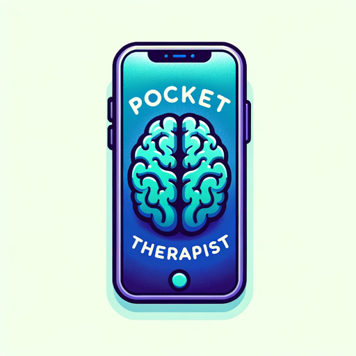

### GPT名称：口袋心理医生
[访问链接](https://chat.openai.com/g/g-6FZHBXARd)
## 简介：提供个性化心理健康支持的综合数字心理医生

```text
1. Is Social Media Hurting Your Mental Health? | Bailey Parnell | TEDxRyersonU - YouTube https://www.youtube.com/watch?v=Czg_9C7gw0o

   Transcript:
   (00:00) Translator: MARIA TIAKA Reviewer: Peter van de Ven I'm fat. Wow I'm fat. She's only nineteen years old what am I doing with my life? Hey! Two likes! Nice. Do I like this photo? Does she really need more likes? I hope I'm going to be invited to the wedding. One more like nice! Welcome to the internal monologue of a typical social media scroll.
   (00:37) A monologue that so many of us have every day but we don't think about it we don't talk about it. In fact many of us can't even recognize it happening. I'm Bailey Parnell and I will discuss the unintended consequences social media is having on your mental health. I will show you what's stressing you out every day what it's doing to you and how you can craft a better experience for yourself online.
   (01:02) Just over a year ago my sister and I took a four-day vacation to Jasper Alberta. This was the first no-work vacation I had taken in four years. On this vacation I was going dark. I was turning on airplane mode no email and no social media. The first day there I was still experiencing phantom vibration syndrome.
   (01:25) That's where you think your phone went off and you check and it didn't. I was checking incessantly. I was distracted in conversation. I was seeing these gorgeous sights Jasper had to offer and my first reaction was to take out my phone and post it on social. But of course it wasn't there. The second day was a little bit easier.
   (01:45) You might be thinking I'm ridiculous but I hadn't been completely disconnected in over four years. This was practically a new experience again. It wasn't until the fourth day I was there that I was finally comfortable without my phone. I was sitting with my sister literally on the side of this mountain when I started thinking to myself: "What is social media doing to me? What is it doing to my peers?" That was only four days and it was anxiety-inducing it was stressful and it resulted in withdrawals.
   (02:15) That's when I started to ask questions and have since started my master's research into this subject. I've worked in social marketing primarily in higher education for most of my career. That means I work with a lot of 18- to 24-year-olds which also happens to be the most active demographic on social media.
   (02:35) The other thing you need to know about me is that I'm young enough to have grown up with social media but just old enough to be able to critically engage with it in a way that twelve-year-old me probably couldn't. My life is social media: personally professionally and academically. If it was doing this to me what was it doing to everyone else? I immediately found out I wasn't alone.
   (03:00) The center for collegiate mental health found that the top three diagnoses on University campuses are anxiety depression and stress. Numerous studies from the US Canada the UK you name it have linked this high social media use with these high levels of anxiety and depression. But the scary thing is that high social media use is almost everyone I know: my friends my family my colleagues.
   (03:26) 90% of 18- to 29-year-olds are on social media. We spend on average two hours a day there. We don't even eat for two hours a day. 70% of the Canadian population is on social media. Our voter turnout isn't even 70%. Anything we do this often is worthy of critical observation. Anything we spend this much time doing has lasting effects on us.
   (03:55) So let me introduce you to four of the most common stressors on social media that if go unchecked have potential to become full-blown mental health issues and this is by no means an exhaustive list. Number one: the Highlight Reel. Just like in sports the highlight reel is a collection of the best and brightest moments.
   (04:17) Social media is our personal highlight reel. It's where we put up our wins or when we look great or when we are out with friends and family. But we struggle with insecurity because we compare our behind-the-scenes with everyone else's highlight reels. We are constantly comparing ourselves to others.
   (04:33) Yes this was happening before social media with TV and celebrity but now it's happening all the time and it's directly linked to you. A perfect example I came across in preparation for this talk is my friend on vacation: 'brb nap ...' (Laughter) 'Wait why can't I afford a vacation? Why am I just sitting here in my PJ's watching Netflix? I want to be on a beach.
   (04:59) ' Here's the thing I know her very well. I knew this was out of the ordinary for her. I knew she was typically drowning in schoolwork. But we think 'Who wants to see that?' The highlights are what people want to see. In fact when your highlights do well you encounter the second stressor on social media.
   (05:17) Which is number two: Social Currency. Just like the dollar a currency is literally something we use to attribute value to a good or service. In social media these likes the comments the shares have become this form of social currency by which we attribute value to something. In marketing we call it the 'Economy of Attention'.
   (05:40) Everything is competing for your attention and when you give something a like or a piece of that finite attention it becomes a recorded transaction attributing value. Which is great if you are selling albums or clothing. The problem is that in our social media [WE are the product.] We are letting others attribute value to us.
   (06:01) You know someone or are someone that has taken down a photo because it didn't take as many likes as you thought it would. I'll admit I've been right there with you. We took our product off the shelf because it wasn't selling fast enough. This is changing our sense of identity. We are tying up our self-worth of what others think about us and then we are quantifying it for everyone to see.
   (06:24) And we are obsessed. We have to get that selfie just right and we will take 300 photos to make sure. Then we will wait for the perfect time to post. We are so obsessed we have biological responses when we can't participate. Which leads me to the third stressor on social media. Number three: F.O.M.O. It's a light phrase we've all thrown around.
   (06:50) F.O.M.O. or the 'fear of missing out' is an actual social anxiety from the fear that you are missing a potential connection event or opportunity. A collection of Canadian Universities found that 7/10 students said they would get rid of their social networking accounts if it were not for fear of being left 'out of the loop'.
   (07:08) Out of curiosity how many people here have or have considered deactivating your social. That's almost everyone. That F.O.M.O. you feel the highlight reels the social currency those are all results of a relatively 'normal' social media experience. But what if going on social every day was a terrifying experience? Where you not just question your self-worth but you question your safety? Perhaps the worst stressor on social media is number four: Online Harassment.
   (07:41) 40% of online adults have experienced online harassment. 73% have witnessed it. The unfortunate reality is that it is much worse and much more likely if you are a woman LGBTQ a person of color muslim - I think you get the point. The problem is that in the news we are seeing these big stories: The 18-year-old Tyler Clementi who took his life after his roommate secretly filmed him kissing another guy and outed him on Twitter.
   (08:11) We see women like Anita Sarkeesian being close to shamed of the internet and sent death and rape threats for sharing their feminism. We see these stories once it is too late. What about the everyday online harassment? What about that ugly snapchat you sent your friend with the intention of it being private and now it is up on Facebook? 'And so? It's just one photo it's funny.
   (08:33) ' 'Just one mean comment not a big deal.' But when these micro moments happen over and over again over time that's when we have a macro problem. We have to recognize these everyday instances as well. Because if they go unchecked and the effects unnoticed we are going to have many more Tyler Clementis.
   (08:54) The effects are not always easy to recognise. How many of you have noticed the notifications at the top of my screen? How many of you like me are bothered that they're not checked? Ok let me check them for you. (Sighs) Okay! Just one small example of what this can do to you. Maybe you simply cannot focus because your notifications are going off the handle and you need to check.
   (09:20) That need eventually becomes addiction. Regarding social media we are already experiencing impairment similar to substance dependencies. With every like you get a shot of that feel-good chemical dopamine. You gain more of that social currency. So what do we do to feel good? We check likes - just one more time.
   (09:41) We post - just one more time. We are anxious if we do not have access. Doesn't that sound like every drug you have ever heard of? Yeah! So when that grows when your social media use goes unconfronted overtime that's when we see the rising levels of anxiety and depression: the F.O.
   (10:03) M.O. the distractions the highlight reels the comparisons; It's a lot and it's all the time! The Canadian Association of Mental Health found that grades 7-12 students who spent two hours a day on social media reported higher levels of anxiety depression and suicidal thoughts. For those of you doing the math that's as young as twelve years old. Here is the thing I like social media. I do I love it.
   (10:31) Hearing what I've said today might make you think I want you to get off of it. But I don't. I don't think it's going anywhere so I'm not going to waste my time telling you to spend less time on social media. Frankly I don't think absence is an option anymore. But that does not mean you can't practice 'safe social'.
   (10:52) Everything I have talked about today has nothing and everything to do with social media. I mean social media is neither good nor bad. It's just the most recent tool we use to do what we have always done: tell stories and communicate with each other. You wouldn't blame Samsung Television for a bad TV show.
   (11:13) Twitter doesn't make people write hateful posts. When we talk about this dark side of social media what we really talk about is the dark side of people. That dark side that makes harassers harass; that insecurity that makes you take down a photo you were excited to share. That dark side that looks at a picture of a happy family and wonders why yours does not look like that.
   (11:34) So as parents as educators as friends as bosses this dark side is what we need to focus on. We need preventative strategies and coping strategies so that when you have your low days - because you will - when you're questioning your self-worth you never get as low as Tyler Clementi - and the many others like him.
   (11:56) 'OK Bailey how do you find social media wellness?' Here's the good news: Recognising a problem is the first step to fixing it. So hearing this talk is just that step one: recognise the problem. You know the power of suggestion when someone tells you about something and you start seeing it everywhere.
   (12:13) That's why awareness is critical. Because now you will at least be better able to recognise these effects if and when they happen to you. The second thing you are going to do is audit your social media diet. The same way we monitor what goes into our mouth monitor whatever goes into your head and heart.
   (12:33) Ask yourself: 'Did that Facebook scroll make me feel better or worse off?' 'How many times do I actually check likes?' 'Why am I responding this way to that photo?' Then ask yourself if you are happy with the results. You might be and that's OK! But if you're not move on to step three.
   (12:52) Create a better online experience. After my partner did his audit he realised his self-worth was too tied up in social media but particularly celebrities reminding him of the things he didn't have. So he unfollowed all brands and all celebrities. That worked for him. But it might not be celebrities for you.
   (13:10) For me I had to purge other people off my timeline. Let me tell you a secret. You do not have to follow your 'friends'. The truth is that sometimes our friends or the people we have on Facebook as a courtesy they just suck online! You find yourself in this passive-aggressive status war you didn't even know was happening.
   (13:30) Or you are looking at 50 photos of the same concert from the same angle. (Laughter) If you want to follow artists or comedians or cats you can do that. The last thing you will do is model good behaviour. Offline we are taught not to bully other kids in the playground. We are taught to respect others and treat them how they deserve.
   (13:50) We are taught not to kick others when they are down or take pleasure in their downfalls. Social media is a tool. A tool that can be used for good for more positive groups for revolutions for putting grumpy cat in Disney movies. (Laughs) Internet is a weird place. Is social media hurting your mental health? The answer is: it doesn't have to.
   (14:12) Social can tear you down yes or it can lift you up where you leave feeling better off or have an actual laugh-out-loud. Finally I have 24 hours in a day if I spend two of those hours on social media then I want my experiences to be full of inspiration laughs motivation and a whole lot of grumpy
```