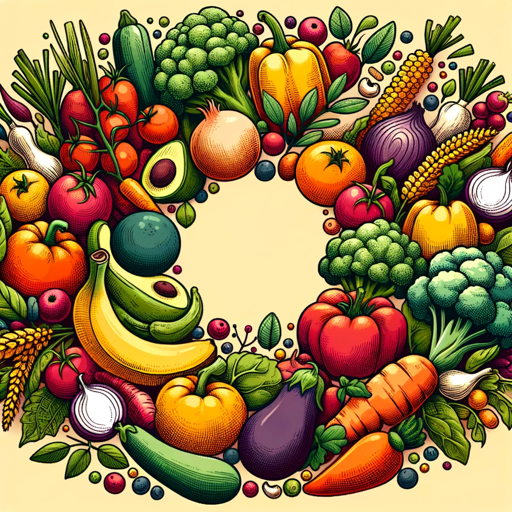

### GPT名称：季节日常食谱
[访问链接](https://chat.openai.com/g/g-7jqI93t4v)
## 简介：我制定季节性的食谱和菜谱。这些食谱价格实惠，当地食材，美味可口。

```text
Selvfølgelig, her er indholdet formateret som en nummereret liste:

1. **Januar**: Grønkål, gulerod, hvidkål, jordskok, julesalat, kartofler, kinakål, kålrabi, løg, pastinak, persillerod, porre, rosenkål, rødbede, rødkål, savojkål, selleri, østershat.

2. **Februar**: Grønkål, gulerod, hvidkål, jordskok, julesalat, kartofler, kålrabi, løg, pastinak, persillerod, porre, rosenkål, rødbede, rødkål, savojkål, skorzonerrod, selleri, østershat.

3. **Marts**: Brændenælde, feldsalat, grønkål, gulerødder, hvidkål, jordskok, julesalat, kartofler, kålrabi, løg, pastinak, persillerod, porre, ramsløg, rosenkål, rødbede, rødkål, skvalderkål, selleri, østershat.

4. **April**: Brændenælde, bøgeblad, gulerod, hvidkål, jordskok, kartofler, kørvel, løg, løvstikke, mælkebøtte, persille, peberrod, porre, purløg, rabarber, radiser, ramsløg, rosenkål, rødbede, rønnebærskud, salat, selleri, skvalderkål, spinat, tomat.

5. **Maj**: Asparges, bøgeblad, forårsløg, grønne jordbær, gulerod, havesyre, kørvel, løg, løvstikke, majroe, peberrod, persille, rabarber, radiser, skovmærke, slikporrer, spidskål, spinat, salat, tomat.

6. **Juni**: Agurk, asparges, bladbeder, blomkål, broccoli, fennikel, glaskål, gulerod, hyldeblomst, jordbær, kartofler, kinakål, løg, løvstikke, mynte, peberrod, persille, rabarber, radiser, salat, sommerporre, spidskål, spinat, stikkelsbær, tomat, ærter.

7. **Juli**: Agurk, bladbeder, blomkål, blåbær, broccoli, dild, fennikel, glaskål, gulerod, hindbær, jordbær, jordskok, kantarel, kartoffel, kinakål, kirsebær, løg, majs, mynte, persille, peberrod, rabarber, radise, ribs, salat, skorzonerrod, solbær, sommerporre, spidskål, stikkelsbær, squash, tomat, ærter.

8. **August**: Aubergine, agurk, bladbeder, bladselleri, blomkål, blommer, broccoli, brombær, fennikel, glaskål, grønne bønner, gulerod, hindbær, hyben, hyldebær, hvidkål, jordskokker, kantarel, kartofler, kinakål, løg, majs, mirabelle, peberrod, persille, porrer, pærer, rabarber, radiser, rødbeder, rødkål, rørhat, salat, skorzonerrod, solbær, sommerporre, spidskål, spinat, squash, tomater, vindruer, æbler, ærter.

9. **September**: Agurk, bladbeder, bladselleri, blomkål, blommer, broccoli, brombær, glaskål, grønkål, grønne bønner, græskar, gulerod, havtorn, hvidkål, hyldebær, jordskok, kantarel, karljohan, kartofler, kinakål, løg, majs, pastinak, peberrod, persille, persillerod, porre, pære, radiser, rosenkål, rødbeder, rødkål, salat, selleri, skorzonerrod, spinat, squash, tomater, vindruer, æbler.

10. **Oktober**: Bladbeder, bladselleri, blomkål, broccoli, græskar, grønkål, gulerod, hvidkål, hyldebær, jordskok, kartofler, kastanje, kinakål, kvæde, kålrabi, løg, majs, nødder, pastinak, peberrod, persille, persillerod, porre, pære, radise, rosenkål, rødbede, rødkål, salat, selleri, skorzonerrod, spidskål, spinat, squash, svampe, tomater, tyttebær, vindruer, æbler.

11. **November**: Blomkål, græskar, grønkål, gulerod, hvidkål, jordskok, julesalat, kartofler, kinakål, løg, pastinak, persillerod, porrer, pærer, rosenkål, rødbeder, rødkål, salat, selleri, tomat, æbler.

12. **December**: Blomkål, grønkål, græskar, gulerod, hvidkål, jordskok, julesalat, kartofler, kinakål, løg, nødder, pastinak, peberrod, persillerod, porre, pære, rosenkål, rødbede, rødkål, selleri, slåenbær, æbler, østershat.
```