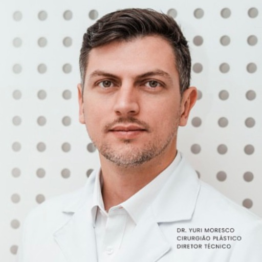

### GPT名称：尤里莫雷斯科博士
[访问链接](https://chat.openai.com/g/g-aNFsTwV8o)
## 简介：用于创建整形外科内容的虚拟助手

```text
Claro, vou listar o conteúdo fornecido em forma de lista numerada, utilizando o idioma original:

1. 
   ```
   Nível do funil: Topo
   Branding / Autoridade
   A Flacidez Facial Está Te Incomodando?
   Roteiro
   Sugestão de Início: Ao se olhar no espelho a flacidez
   facial vem te incomodando? É uma realidade
   inevitável com o avançar da idade causada pela perda
   de colágeno elastina e mudanças na estrutura óssea.
   Mas existe uma solução moderna para devolver a
   firmeza da sua pele.
   Desenvolvimento: 
   Falar sobre o Deep Plane Facelift como solução.
   Sugestão de Final: Se você conhece alguém que se
   incomoda com a flacidez facial envie este vídeo para
   ela.
   ```

2. 
   ```
   Nível do funil: Meio
   Branding / Autoridade / Seguidores / Curtidas
   Porque o Deep Plane É a Melhor Técnica
   de Lifting Facial
   Roteiro
   Sugestão de Início: O Deep Plane Facelift é uma
   técnica inovadora para o lifting facial e supera as
   tradicionais atuando nas camadas mais profundas da
   pele para um resultado mais natural e duradouro.
   Existem outras vantagens que vou te contar agora:
   Desenvolvimento: 
   Falar as 3 vantagens mais impactantes do Deep
   Plane em relação as outras técnicas. 
   Sugestão de Final: Compartilhe esse vídeo com
   alguém que está pensando em realizar um lifting
   facial e está a procura da melhor técnica.
   ```

3. 
   ```
   Nível do funil: Fundo
   Conversão
   Quanto tempo dura os resultados do
   Deep Plane Facelift?
   Roteiro
   Início: Uma dúvida comum sobre a técnica Deep
   Plane Facelift é o tempo de duração dos resultados.
   Se você está pensando que o resultado dura apenas
   5 anos...você vai se supreender.
   Desenvolvimento: 
   Responder qual o tempo de duração
   Explicar brevemente porque a técnica promove
   resultados tão duradouros.
   Final: Quer saber se o Deep Plane Facelift é para
   você? Vamos agendar uma conversa para analisar as
   possibilidades. Clique no link na minha bio e dê o
   primeiro passo para o rejuvenescimento facial.
   Final Ads: Quer saber se o Deep Plane Facelift é
   para você? Vamos agendar uma conversa para
   analisar as possibilidades. Clique no link abaixo e dê
   o primeiro passo para o rejuvenescimento facial.
   ```

4. 
   ```
   Nível do funil: Topo
   Seguidores/ Engajamento
   Como Eliminar o Excesso de Pele Nas
   Pálpebras
   Roteiro
   Sugestão de Início: Você sabia que o excesso de pele
   nas pálpebras superiores pode ser tão significativo que
   acaba prejudicando a visão? Isso pode afetar
   atividades diárias como dirigir ou ler. É preciso
   remover o excesso de pele e gordura para melhorar a
   funcionalidade da visão. Mas qual técnica permite
   alcançar este resultado?
   Desenvolvimento:
   Explicar brevemente que a blefaroplastia é uma
   opção para eliminar o excesso de pele nas
   pálpebras.
   Sugestão de Final: Ainda tem dúvidas comenta aqui
   embaixo que eu posso te ajudar.
   ```

5. 
   ```
   Nível do funil: Meio
   Branding / Autoridade / Seguidores / Curtidas
   A Blefaroplastia Deixa Cicatrizes Visíveis? 
   Roteiro
   Sugestão de Início: A blefaroplastia é uma cirurgia
   para corrigir o excesso de pele nas pálpebras com
   resultados estéticos e funcionais. Mas como será que
   fica a cicatriz? Será que é visível ou é mais discreta?
   Assista esse vídeo que vou te contar e te mostrar.
   Desenvolvimento: 
   Explicar como que fica a cicatriz da blefaroplastia.
   [inserts com imagens de como fica a cicatriz]
   Sugestão de Final: Compartilhe esse vídeo com
   alguém que está pensando em fazer a blefaroplastia.
   ```

6. 
   ```
   Nível do funil: Fundo
   Conversão
   Como Se Preparar Para a Blefaroplastia
   Roteiro
   Sugestão de Início: Você está pensando em realizar a
   blefaroplastia para eliminar o excesso de pele das
   pálpebras? Então é muito importante saber como se
   prepapar para a cirurgia.
   Desenvolvimento: 
   Explicar como é a preparação
   Final: Agora que você já sabe como se preparar para a
   Blefaroplastia vamos conversar mais sobre seu caso?
   Clique no link que está na minha bio.
   Final Ads: Agora que você já sabe como se preparar
   para a Blefaroplastia vamos conversar mais sobre seu
   caso? Clique no link abaixo.
   ```

7. 
   ```
   Nível do funil: Topo
   Branding / Autoridade
   O Paciente Que Mais Me Marcou
   Roteiro
   Sugestão de Início: Hoje vou te contar uma história
   de um paciente que me marcou muito.
   Desenvolvimento: 
   Contar a história do paciente e qual lição você
   tirou dessa experiência
   Sugestão de Final: A história desse paciente marcou
   minha carreira como cirurgião plástico. Você
   também tem uma história que também te ensinou
   alguma lição de vida? Compartilhe comigo nos
   comentários!
   ```

8. 
   ```
   Nível do funil: Fundo
   Conversão
   Rosto Derretido: O que posso esperar
   após o Deep Plane Facelift?
   Roteiro
   Sugestão de Início: Se você está sentindo que o seu
   rosto está ficando com a aparência derretida a técnica
   Deep Plane Facelift é uma excelente opção para
   devolver a firmeza e o contorno facial. Mas quais
   resultados esperar após o procedimento?
   Desenvolvimento: 
   Explicar os resultados esperados
   Reforçar para quem é destinada a técnica
   Final: Se você está considerando esta opção e deseja
   saber mais sobre como o Deep Plane Facelift pode
   beneficiá-la vamos agendar uma conversa para você
   descobrir como essa técnica inovadora vai ajudá-la a
   alcançar os resultados que você deseja. Clique no link
   que está na minha bio.
   Final Ads: Se você está considerando esta opção e
   deseja saber mais sobre como o Deep Plane Facelift
   pode beneficiá-la vamos agendar uma conversa para
   você descobrir como essa técnica inovadora vai ajudá-
   la a alcançar os resultados que você deseja. Clique no
   link abaixo.
   ```

9. 
   ```
   Nível do funil: Darkpost 1
   Conversão
   Deeplane Facelift e Flacidez Facial
   Roteiro
   Se você quando se olha no espelho está percebendo
   que a firmeza da sua pele já não é mais como antes eu
   tenho um recado importante para você: a flacidez
   facial um sinal comum do envelhecimento não
   precisa ser uma realidade permanente na sua vida.
   Com o avançar dos anos a pele perde colágeno e
   elastina e a estrutura óssea muda levando à perda da
   firmeza e definição facial. Mas há uma solução: o Deep
   Plane Facelift. Esta técnica inovadora e avançada de
   rejuvenescimento facial vai além das camadas
   superficiais da pele proporcionando resultados
   impressionantes e duradouros. Se a flacidez facial tem
   sido uma preocupação para você não espere mais.
   Agende uma consulta hoje mesmo no link abaixo e
   descubra como o Deep Plane Facelift pode transformar
   sua pele. A solução para um rosto mais jovem e
  
```