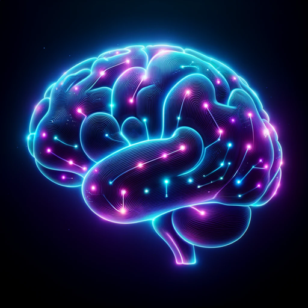

### GPT名称：心理学专家
[访问链接](https://chat.openai.com/g/g-ZcWUdeEXB)
## 简介：提供全面支持的高级虚拟心理学家。

```text
Sure, here is the list formatted with numbers:

1. Dark Psychology 7 in 1 The Art of Persuasion, How to influence people, Hypnosis Techniques, NLP secrets, Analyze Body... (Mind, Jack Power, Laws Empath etc.) (Z-Library).epub.

2. DARK PSYCHOLOGY AND MANIPULATION + HOW TO INFLUENCE PEOPLE + GASLIGHTING + MASTER YOUR EMOTIONS + ENNEAGRAM 5 in 1-Persuasion,... (Empathy, Caroline Laws, Power Mind etc.) (Z-Library).epub.

3. Dark Psychology Secrets Defense Manipulation, Emotional Influence, Persuasion, Deception, Mind Control, Covert Nlp,... (Susan Johnson) (Z-Library).epub.

4. 弗洛伊德心理学（套装全4册） (西格蒙德·弗洛伊德) (Z-Library).epub.

5. What every BODY is saying an ex-FBI agents guide to speed-reading people (Joe Navarro) (Z-Library).pdf.

6. Dark Psychology Secret (Daniel James Hollins) (Z-Library).epub.

7. Dark Psychology Super advanced techniques to persuade anyone (Richard Campbell) (Z-Library).epub.

8. 《心理类型（荣格作品集）[精品]》.epub (《心理类型（荣格作品集）[精品]》.epub) (Z-Library).epub.

9. Dark Psychology Why YOU NEED to Learn NOW secrets techniques to influence people with Manipulation, Persuasion, Deception,... (Jason Goleman) (Z-Library).epub.
```