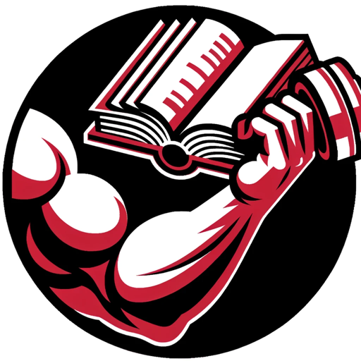

### GPT名称：肌肉导师
[访问链接](https://chat.openai.com/g/g-eIZwKpoCC)
## 简介：专注于健身和类固醇的专家，优先考虑安全和知识

```text

1. BOOKMARKS:
   - Front Cover
   - Foreword
   - Introduction
   - In the Beginning
   - Fast Forward
   - Basic 3 day Mirror Training Schedule
     - Day 1 Week 1
     - Day 2 Week 1
     - Day 3 Week 1
     - Day 1 Week 2
     - Day 2 Week 2
     - Day 3 Week 2
     - System Requirements
   - Training Change Month 3 to 6
     - Day 1
     - Day 2
     - Day 3
     - Abdominals
   - Diet First 6 Months
   - Basic Cycle
   - 6 Months on
   - Show Preparation
   - Precompetition Training
     - Day 1 Am Workout
     - Day 1 PM Workout
     - Day 2 AM Workout
     - Day 2 PM Workout
     - Day 3 AM Workout
     - Day 3 PM Workout
   - Final 6 Week Course
   - Show Day
   - My Family
   - Dedication and Devotion
   - Make the System work for you
   - Personal Consultation Offer
   - Who is Mick Hart
   - The No Bull Collection
   - The Laymans Guides to Steroids Books
   - Mick Hart Discussion Board
   - Free No Bull Ezine
   - Mick Hart Training Systems
   - Cover

2. Foreword from Dad
   - The actual time from making the decision to competing was approximately one year. However, there was a period of time previous to this based on standard lifts and hit and miss three-day training (due to girls and booze - yeah I know!!).

3. Introduction
   - The reader will without a shadow of a doubt ask themselves whether this system will work for them. Now if you doubt that it could AND that you also believe that I gave Chris "extra special" additives that you cannot get hold of OR special training exercises or systems that only he could get access to then you are going to fail in what you do now and in the future - believe me I do not lie to you.

4. In The Beginning
   - This personal part has to be told to show the determination and also the close bond that my new family developed at the beginning that would last and to also give the reader an idea as to this lad's will to fight which became an urge to achieve. This was to always impress me from the day of his birth to present day - and for time to come I am sure. I know that he will not let his mother or me down.

5. FAST FORWARD
   - And so the years passed.... He maintained the combat training but slowly and gradually he began to take an interest in bodybuilding. By the age of sixteen, he started on many occasions a training system that I put together - nothing fancy basically a three-day total body system that I always recommend for beginners - Chris was no exception.

6. BASIC THREE DAY MIRROR TRAINING SCHEDULE
   - Day One / Week One: Total Body Heavier Lower Rep Training
     - Bar press (or Smiths) behind neck 3 x 6 - 8, Squats 3 x 8 -10, Lat pull downs 3 x 6 - 8, etc.
   - Day Two/Week One: Total body
     - Seated d/bell press 3 x 8 - 10, Bent barbell row 3 x 8 - 10, Leg curl 3 x 10 - 12, etc.
   - Day Three/Week One: Total body Workout as day one!

7. System requirements:
   - This routine is somewhat special in as much as it allows the body to be shocked into growth by the two different types of system that have been pulled together. One basic the other working on lighter lower compound exercises.

8. TRAINING CHANGE FROM MONTH 3 to 6
   - During the first six months period, we changed the training from a three-day system with four days off to a three days on and only one off. Staying with the three-day system so religiously most certainly paid dividends without a doubt.

9. Diet - FIRST SIX MONTHS
   - From the start of the training year, his diet was mainly based on very high-quality protein and carbohydrates taken through a meal every three hours which roughly worked out to about six meals a day.

10. BASIC CYCLE
    - Most think that Chris's gains were the result of some fantastic new steroid cycle that I concocted simply because he is my son but they are so wrong. This makes this report all the more satisfying for me to write.

11. SIX MONTHS ON
    - The first six months had shown great results. Gains had been fast and strength increases had also grown to match the size; water retention was also extremely low … thankfully.

12. SHOW PREPARATION
    - We were nearing the run-up to the show; I estimated that we would need about three months clear to prepare for the show.

13. PRE-COMPETITION TRAINING SYSTEM
    - So the stage was set and we were looking at the final 6-week run-up to the show. He was (as predicted) nervous as hell but looking good and on target.

14. MY FAMILY
    - I was told by a friend who uses the Mick Hart Discussion Board of how proud that he was to be part of the NO BULL family - a "BULL" as the lads proudly call themselves.

15. DEDICATION & DEVOTION by Chris Hart
    - Something all bodybuilders weight lifters powerlifters and other athletes share is a certain degree of dedication and devotion to their sport - whatever it may be.

16. Make The System Work for You
    - I know that there are many of you that will wish to exploit and convert these methods for you're your own use and I hope that you do; I would deem it a great honor to know that there are many out there training as hard as my son has done to make me proud - an honor indeed.

17. Who is Mick Hart
    - Mick is a fully qualified BAWLA Olympic grade A Coaching Instructor and has been in professional bodybuilding for over 25 years in which time he has become one of the leading authorities in the sport.

18. The No Bull Collection Magazine
    - Subscriptions available online at http://www.nobullcollection.com

19. The Laymans Guides to Steroid Books 1 and 2. 
    - Available online at http://www.mickhart.com/steroidbooks

20. Mick Hart Discussion Board
    - Visit http://www.mickhart.com/board.shtml

21. The Free No Bull Ezine
    - Join Mick Hart's FREE "NO BULL Ezine"... and get FREE bodybuilding and steroid articles interviews cycles stacks cartoons humor stories news and more direct from Mick Hart's "No Bull" team.

22. Mick Hart Training Systems
    - R/o 7 Barlborough Road, Clowne, Chesterfield, Derbyshire, S43 4RA, England

23. Train hard and be strong Chris Hart January 2003

24. Image Format: JPEG
    - Dimensions: 594 x 841

25. Image Format: Portable Network Graphic (PNG)
    - Bits Per Pixel: 24, Color: Truecolor, Dimensions: 105 x 75, Interlaced: Yes

26. Image Format: JPEG
    - Dimensions: 305 x 250

27. Image Format: Portable Network Graphic (PNG)
    - Bits Per Pixel: 24, Color: Truecolor, Dimensions: 200 x 731, Interlaced: Yes

28. Image Format: JPEG
    - Dimensions: 186 x 241

29. Image Format: JPEG
    - Dimensions: 600 x 416

30. Image Format: Portable Network Graphic (PNG)
    - Bits Per Pixel: 24, Color: Truecolor, Dimensions: 615 x 939, Interlaced: Yes

31. Image Format: JPEG
    - Dimensions: 930 x 741

32. Image Format: JPEG
    - Dimensions: 670 x 956

33. Image Format: Portable Network Graphic (PNG)
    - Bits Per Pixel: 24, Color: Truecolor, Dimensions: 579 x 879, Interlaced: Yes

34. Image Format: JPEG
    - Dimensions: 1020 x 660

End of copied content.
```