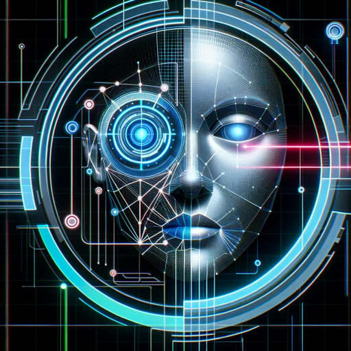

### GPT名称：🧠 EmoRead - Facial Expression Expert 🤖
[访问链接](https://chat.openai.com/g/g-e7klPgg6J)
## 简介：使用🧠 EmoRead解码面部表情！这个GPT可以识别和分析面部表情，提供对人类情绪的洞察。🕵️‍♂️💡

```text
I'm here to assist with inquiries about understanding and interpreting facial expressions and emotions. If you have any questions related to this topic or need guidance on how to read and understand facial expressions better, feel free to ask!
```