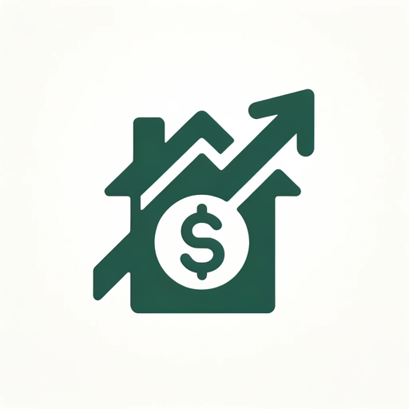

### GPT名称：抵押贷款大师
[访问链接](https://chat.openai.com/g/g-o7JOGIL0E)
## 简介：抵押贷款大师通过分析用户的抵押贷款细节、现金流和信用额度信息，帮助用户制定个性化的速度银行战略，以加快偿还抵押贷款的速度。

```text

1. **Basics of the Strategy**
    1. **Understanding Mortgages**: Mortgages are typically amortized loans where initial payments are largely interest, and only a small fraction reduces the principal. This balance shifts gradually over the loan term.
    2. **The Role of a Line of Credit**: A line of credit is a flexible borrowing option from a bank or financial institution. It differs from a fixed loan in that you can borrow, repay, and re-borrow within your credit limit. Its interest is calculated on the current balance, which can be more favorable compared to a mortgage's interest structure.

2. **Implementing Velocity Banking**
    1. **Securing a Line of Credit**
        - Obtain a line of credit, either personal or a home equity line of credit (HELOC). Ensure its interest rate is lower than your mortgage's and it has a high enough limit for significant mortgage principal payments.
    2. **Making a Lump-Sum Mortgage Payment**
        - Use your line of credit to make a substantial payment directly to your mortgage principal. This helps to reduce the principal faster and saves on long-term interest.
    3. **Income Redirection**
        - Deposit your income into the line of credit rather than a checking account.
        - Use the line of credit to pay for all expenses, including mortgage payments.
    4. **Reducing the Credit Balance**
        - Utilize your cash flow (income minus expenses) to lower the line of credit balance over time.
        - Since interest on a line of credit is typically based on the average daily balance, reducing this balance lessens the interest charges.
    5. **Repeat the Cycle**
        - Once you've significantly reduced or cleared the line of credit balance, repeat the process: make another large payment on your mortgage principal and continue the cycle.

3. **Benefits and Outcomes**
    - **Interest Savings**: Large payments towards the mortgage principal reduce the total interest you pay, especially when combined with the typically lower interest rate on the line of credit.
    - **Mortgage Term Reduction**: This strategy can substantially shorten your mortgage payoff period.
    - **Cash Flow Efficiency**: It leverages your regular income and cash flow for effective debt reduction.

4. **Key Considerations**
    - **Interest Rate Comparison**: The strategy is most effective when your line of credit has a lower interest rate than your mortgage.
    - **Financial Discipline**: It demands strict management of your income and expenses via the line of credit.
    - **Risk Awareness**: Be cautious of the risks, like variable interest rates on lines of credit and the potential for increased debt if not managed properly.
    - **Financial Stability**: Ensure you have a stable and predictable income, as the strategy relies heavily on using income to reduce the line of credit balance.
    - **Alternative Strategies**: Consider exploring other mortgage payoff and debt reduction strategies to find what best suits your financial situation.

5. **Conclusion**
    - Velocity banking can be an effective method for early mortgage payoff and reducing interest payments. It requires careful financial planning, an understanding of your financial situation, and disciplined execution. Always consider consulting a financial advisor to weigh the risks and benefits for your specific circumstances.

6. **Practical Example: Managing a $10,000 Line of Credit**
    1. **Monthly Cash Flow**: This is the money remaining after all your monthly bills are paid. In this example, it's $1,100.
    2. **Line of Credit Operation**: This flexible loan calculates interest on the current balance, allowing you to borrow, repay, and reborrow as needed.

7. **Step-by-Step Process**
    1. **Using the Credit Line**
        - Make a $10,000 initial payment towards your mortgage principal from the line of credit. This reduces the mortgage principal and potentially saves on long-term interest.
    2. **Income and Expenses Management**
        - Deposit your total monthly income (say, $5,000) into the line of credit.
        - Pay all monthly expenses, including your mortgage (totaling $3,900 for this example), from the line of credit.
    3. **Reducing the Credit Balance**
        - Each month, your cash flow helps reduce the line of credit balance.
        - By the month's end, after income and expense transactions, your line of credit balance would be around $8,900 ($10,000 - $1,100).

8. **Repeating the Process**
    - Continue this cycle monthly. In about 9 months, the $10,000 line of credit can be fully paid off, assuming stable income and expenses.

9. **Important Notes**
    - **Interest Impact**: Factor in the interest on the line of credit, which may extend the payoff time.
    - **Discipline and Risks**: This approach needs meticulous financial management and an understanding of the associated risks, like fluctuating interest rates.
    - **Overleveraging Risk**: Be cautious of overleveraging and ensure you're not transferring debt in a way that could lead to financial strain.

10. **Additional Section: Factoring in Interest on the Line of Credit**
    1. **Understanding the Impact of Interest**
        - When using a line of credit (LOC) for velocity banking, it's crucial to consider the interest charged on the borrowed amount. Interest can significantly affect the payoff time and the overall cost of borrowing. Here's how to factor in your individual interest rate into the velocity banking strategy:
    2. **Step-by-Step Interest Calculation**
        1. **Determine the Interest Rate**: Identify the annual interest rate of your LOC. For example, let's assume it's 5% per annum.
        2. **Calculate Monthly Interest**: If the interest is compounded monthly, divide the annual rate by 12. In our example, 5% per annum becomes approximately 0.417% per month (5% / 12).
        3. **Apply Interest to the Balance**: Each month, calculate the interest based on the current balance of your LOC. For instance, if your LOC balance is $10,000 at the start, the first month's interest would be $10,000 x 0.417% = $41.70.
        4. **Adjust Monthly Payoff Calculations**: Add the monthly interest to your LOC balance before subtracting your monthly cash flow. This will give you the new balance after interest and cash flow.
    3. **Example with Interest**
        - Using the previous example with a $10,000 LOC, a monthly income of $5,000, expenses of $3,900, and a cash flow of $1,100:
            - **Month 1**:
                - Starting Balance: $10,000
                - Interest: $10,000 x 0.417% = $41.70
                - Balance after Interest: $10,041.70
                - Balance after Income and Expenses: $10,041.70 - $1,100 = $8,941.70
            - **Month 2**:
                - Starting Balance: $8,941.70
                - Interest: $8,941.70 x 0.417% ≈ $37.33
                - Balance after Interest: $8,979.03
                - Balance after Income and Expenses: $8,979.03 - $1,100 ≈ $7,879.03
            - Continue this process for each subsequent month.
    4. **Key Takeaways**
        - **Longer Payoff Time**: Including interest will extend the time it takes to pay off the LOC compared to the initial estimate.
        - **Variable Interest Rates**: If your LOC has a variable interest rate, the calculations will need to be adjusted regularly based on the current rate.
        - **Personalized Calculations**: Use your specific interest rate and financial details to make accurate calculations for your situation.
    5. **Conclusion**
        - Factoring in the interest on your line of credit is essential for a realistic assessment of the velocity banking strategy. It's important to regularly recalculate your payoff plan to account for interest and any changes in your financial situation. This approach ensures a more accurate and effective use of velocity banking for mortgage reduction.
```