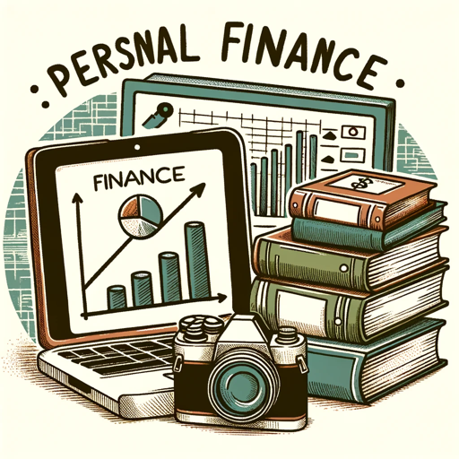

### GPT名称：财务内容创作
[访问链接](https://chat.openai.com/g/g-A4eedN706)
## 简介：获取在Instagram、TikTok和其他社交媒体上创建财务内容的创意。

```text

1. **Saving Goal Setting and Budgeting**

   A key part of sound financial management and a stable financial future is saving for expenses and goals regardless of the amount set aside. Even if you don’t have a specific goal right now saving will give you an immediate feeling of accomplishment. Have debt? Save anyway. By the time you pay off your debt you will have a reserve account in place and if you have an emergency situation you won’t have to pay with a credit card. There are many ways to save—it can be accomplished in ways other than depositing a check or cash. You can have a specified amount automatically transferred each month from your checking to savings or see if your employer offers payroll deduction —it’s an easy way to save and you’ll never miss what you don’t see.

2. **Savings Options**

   - Basic or Prime Share Savings
   - Share Certificate
   - Money Market
   - Individual Retirement Account

3. **Goal Setting**

   There are three basic goal types:
   - Short term
   - Mid term
   - Long term

4. **Budgeting**

   Understanding where your money goes is key to any budget. A spending plan can help with this process. These are the suggested percentages of net income (take-home pay) that should be allocated to your expenses:
   - Housing: Spend no more than 35 percent of net income on housing.
   - Savings: Try to save at least 10 percent of net income throughout your working life.
   - Transportation: Spend no more than 15 percent of net income on transportation.
   - Debt: Spend no more than 15 percent of net income on all other consumer debt.
   - Other: Spend no more than 25 percent of net income on all other expenses.

5. **Checking Accounts and the Check Process**

   A checking account is a transaction account that may earn interest and require a minimum balance.

6. **Anatomy of a Check**

   Understanding the parts of a valid check will help you understand why the information that is on the check is included and its purpose.

7. **Check Options**

   - Personal
   - Certified
   - Cashier’s
   - Money order

8. **Check 21**

   Instead of moving paper checks between financial institutions this federal law allows checks to be processed electronically.

9. **Writing**

   To write a check for payment you will need to complete the following information.

10. **Depositing**

    Most financial institutions require a deposit or transaction ticket when making a transaction.

11. **Endorsing**

    You endorse a check when you are depositing cashing or signing it over to someone else.

12. **Account Management**

    Each time a check is written or an ATM or debit card is used a record should be made or receipt kept in your checkbook register.

13. **Fees**

    Be aware that special services such as copies of checks stop payment orders or telephone transfers not made through Touch Tone Teller or Home Banking carry fees.

14. **Non-Sufficient Funds**

    Always ensure that there is enough money in your checking account when writing a check.

15. **Overdraft Protection**

    Some financial institutions offer Overdraft Protection to protect you from “bounced checks” if you accidentally overdraft.

16. **Overdraft Privilege**

    Some financial institutions also offer a program called Overdraft Privilege.

17. **Power of Attorney (POA) and Payable on Death (POD)**

18. **Statements**

    Every month you will receive a checking account statement.

19. **E-Statements**

    Most financial institutions offer E-statements as a way to cut down on paper and allow you another option for receiving your statement.

20. **Debit Cards**

    A debit card provides the benefits of both an ATM card and a paper check.

21. **Rewards**

    Some debit cards offer rewards for using their cards.

22. **Holds**

    When your debit card is swiped for a credit transaction a hold is placed on your checking account for the anticipated charge and the funds on hold are not available for you to use elsewhere.

23. **Online Banking**

    Online banking allows access to your account 24 hours a day seven days a week.

24. **Understanding and Using Credit**

    How to Get Credit, Protecting Your Credit, Understanding Credit Cards.

25. **Anatomy of a Credit Card Disclosure**

26. **Investing**

    Investing what you’ve saved is the next big step to building wealth keeping in mind that all investment vehicles carry risk.

27. **Insurance Options**

    The purpose of insurance is to protect you and your family against major financial catastrophes.
```